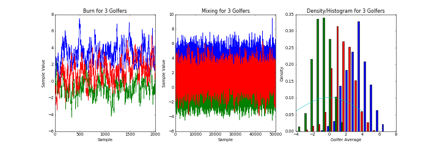

# MCMC Part 2: Metropolis

My code uses the Metropolis algorithm (not Metropolis-Hastings) to implement approximation of unknown posterior distributions. To improve numerical performance, all likelihoods are computed as log-likelihoods. When implementing Metropolis, the acceptance ratio is computed as the exponential of the difference of the log-likelihoods. Additionally, constants added or subtracted to the log-likelihoods are not included since they cancel when the difference is taken.

The code is structured into several classes. The main class is the Network class. This class maintains the structure for all of the nodes and implements the sampling process. Each of the nodes are descendants of a Node class. Depending on the distribution associated with the node a different class exists. The following are the classes descended from the Node class.

- NormalNode: for normal distributions with either nodes or parameters for mean and variance
- GammaNode: for gamma distributions with either nodes or parameters for alpha and beta
- InvGammaNode: for the inverse gamma distribution with nodes or parameters alpha and beta
- PoissonNode: for the Poisson distribution with node or parameter theta
- BetaNode: for the Beta distribution with nodes or parameters alpha and beta
- BernoulliNode: for Bernoulli or binary distribution
- NormalNodeSum: for normal distributions with either nodes or parameters for mean1, mean2, and variance
- NormalNodePi: for normal distributions raised to the power of pi with nodes or parameters mean and variance

Worth mentioning is that the BernoulliNode class, although inheriting from the Node class, varies significantly. As parameters to the BernoulliNode are a list of parents and a list of probabilities. The probabilities are entered into a tree structure (implemented in the BernoulliTree and ProbabilityNode classes). Thus, the BernoulliNode class can have any number of parents. When the node's sample() or likelihood() function is called the node requests the current value of its list of parents to traverse the tree and either returns the probability or a sample of that probability.

TODO: describe the proposal classes

The code is backwards compatible with the previous lab as well. All values produced match those produced previously.

The following are the results for several different models on which my code has been tested.

## Faculty Evaluations Model

I ran the faculty evaluations model for 2500 samples keeping every 50th sample. The following plot shows the prior distribution functions along with histograms of the posterior samples for both the mean and the variance nodes.

Before sampling a burn-in of 300 samples was performed. The following shows the burn-in samples reaching steady-state for both the mean and variance nodes.

The final figure shows the mixing plots of both mean and variance nodes. The nodes are both well mixed.

## Professional Golfers Model

The golfer model is run for 50 samples keeping every 10th sample. The burn in runs for xxxx samples. The following are the results from the simulation in the format described on Learning Suite.

	1: VijaySingh -3.870369; 90% interval: (-4.533923, -3.284346)
	2: TigerWoods -3.643099; 90% interval: (-4.373574, -3.055726)
	3: ErnieEls -3.551826; 90% interval: (-4.418274, -2.407197)
	4: PhilMickelson -3.233727; 90% interval: (-4.039154, -2.647843)
	5: StewartCink -3.121127; 90% interval: (-3.546639, -2.458720)
	6: JayHaas -2.929284; 90% interval: (-3.464378, -2.160337)
	7: SergioGarcia -2.862101; 90% interval: (-3.504120, -2.292249)
	8: StephenAmes -2.856846; 90% interval: (-3.405962, -2.003843)
	9: RetiefGoosen -2.805451; 90% interval: (-3.689784, -2.019873)
	10: PadraigHarrington -2.790978; 90% interval: (-3.942948, -1.800178)
	11: ScottVerplank -2.767383; 90% interval: (-3.207763, -2.238375)
	12: ChrisDiMarco -2.673423; 90% interval: (-3.128667, -2.315301)
	13: TomLehman -2.502487; 90% interval: (-3.323905, -1.662960)
	14: ShigekiMaruyama -2.500471; 90% interval: (-3.011956, -1.924993)
	15: JerryKelly -2.494928; 90% interval: (-2.908119, -1.988926)
	16: DavisLoveIII -2.490225; 90% interval: (-3.051065, -1.782557)
	17: AdamScott -2.413172; 90% interval: (-3.392549, -1.666767)
	18: RobertAllenby -2.375736; 90% interval: (-2.855637, -1.980666)
	19: K.J.Choi -2.362520; 90% interval: (-3.005774, -1.815885)
	20: JesperParnevik -2.337055; 90% interval: (-2.916139, -1.588675)
	21: ZachJohnson -2.319036; 90% interval: (-3.094893, -1.674766)
	22: KennyPerry -2.315580; 90% interval: (-3.084768, -1.681940)
	23: RorySabbatini -2.296833; 90% interval: (-3.054055, -1.750676)
	24: JustinRose -2.284954; 90% interval: (-2.964704, -1.698567)
	25: LukeDonald -2.190143; 90% interval: (-2.835905, -1.424991)
	26: ChadCampbell -2.184356; 90% interval: (-2.832117, -1.785896)
	27: DavidToms -2.161495; 90% interval: (-2.792525, -1.667243)
	28: LorenRoberts -2.125351; 90% interval: (-2.801496, -1.718342)
	29: PaulCasey -2.107713; 90% interval: (-2.882254, -1.538208)
	30: LeeJanzen -2.101637; 90% interval: (-2.584693, -1.690911)
	31: KirkTriplett -2.088229; 90% interval: (-2.705547, -1.584115)
	32: FredrikJacobson -2.072823; 90% interval: (-2.714263, -1.456826)
	33: BoVanPelt -2.061786; 90% interval: (-2.602540, -1.574822)
	34: SteveFlesch -2.060049; 90% interval: (-2.900597, -1.573306)
	35: RodPampling -2.046228; 90% interval: (-2.566483, -1.547633)
	36: MikeWeir -2.029379; 90% interval: (-2.626677, -1.389943)
	37: JustinLeonard -1.996180; 90% interval: (-2.686623, -1.378705)
	38: CarlosFranco -1.976944; 90% interval: (-2.619959, -1.273603)
	39: ArronOberholser -1.964026; 90% interval: (-2.548121, -1.254314)
	40: CharlesHowellIII -1.963710; 90% interval: (-2.571378, -1.178887)
	41: BrinyBaird -1.937310; 90% interval: (-2.418684, -1.453350)
	42: GeoffOgilvy -1.910653; 90% interval: (-2.446207, -1.430559)
	43: CarlPettersson -1.909091; 90% interval: (-2.696732, -1.417009)
	44: NickO'Hern -1.900884; 90% interval: (-3.835593, 0.706796)
	45: BernhardLanger -1.895640; 90% interval: (-2.548882, -1.243415)
	46: JohnDaly -1.883484; 90% interval: (-2.407382, -1.283602)
	47: BradFaxon -1.861176; 90% interval: (-2.306745, -1.146693)
	48: NickPrice -1.848014; 90% interval: (-2.719582, -1.008089)
	49: TedPurdy -1.831877; 90% interval: (-2.353749, -1.199796)
	50: SpencerLevin -1.828773; 90% interval: (-4.683425, 0.798956)
	51: StephenLeaney -1.821567; 90% interval: (-2.454949, -1.268191)
	52: ScottHoch -1.799234; 90% interval: (-2.446322, -1.082731)
	53: StuartAppleby -1.798316; 90% interval: (-2.438023, -1.335889)
	54: JeffSluman -1.795452; 90% interval: (-2.194757, -1.381016)
	55: DarrenClarke -1.793455; 90% interval: (-2.801692, -0.755693)
	56: BillHaas -1.793362; 90% interval: (-2.795072, -1.010638)
	57: TimClark -1.750893; 90% interval: (-2.251487, -1.045362)
	58: AngelCabrera -1.745823; 90% interval: (-3.322712, -0.562550)
	59: DuffyWaldorf -1.741652; 90% interval: (-2.247337, -1.077911)
	60: FredFunk -1.738927; 90% interval: (-2.455003, -1.213210)
	61: ChrisRiley -1.735898; 90% interval: (-2.247696, -1.252008)
	62: JoeDurant -1.731473; 90% interval: (-2.383831, -1.001745)
	63: DavidHowell -1.724987; 90% interval: (-3.589254, 0.258929)
	64: FrankLickliter -1.693554; 90% interval: (-2.365243, -1.185156)
	65: CoreyPavin -1.693382; 90% interval: (-2.184957, -1.180978)
	66: FredCouples -1.684799; 90% interval: (-2.598980, -0.953095)
	67: JeffMaggert -1.676131; 90% interval: (-2.527322, -1.051070)
	68: BrentGeiberger -1.674149; 90% interval: (-2.168826, -1.076172)
	69: BrianBateman -1.649444; 90% interval: (-2.250922, -1.054713)
	70: TomPernice,Jr. -1.648160; 90% interval: (-2.319098, -1.061492)
	71: BobTway -1.639203; 90% interval: (-2.182866, -1.074421)
	72: TimPetrovic -1.612658; 90% interval: (-2.167091, -0.825271)
	73: DennisPaulson -1.612081; 90% interval: (-2.181808, -0.896559)
	74: MiguelAngelJimenez -1.605032; 90% interval: (-3.068173, -0.581360)
	75: JohnSenden -1.597242; 90% interval: (-2.246751, -1.063953)
	76: DavidPeoples -1.597137; 90% interval: (-2.176287, -1.043321)
	77: TimHerron -1.582399; 90% interval: (-2.141679, -0.974876)
	78: MarkHensby -1.579851; 90% interval: (-2.068963, -1.008993)
	79: BobEstes -1.569144; 90% interval: (-2.315723, -0.848778)
	80: S.K.Ho -1.558708; 90% interval: (-2.936123, -0.329623)
	81: CameronBeckman -1.557688; 90% interval: (-2.107842, -1.059216)
	82: JohnRiegger -1.540701; 90% interval: (-2.215680, -0.774314)
	83: BenCrane -1.540292; 90% interval: (-2.117274, -0.949202)
	84: TomByrum -1.521494; 90% interval: (-2.080287, -1.131279)
	85: J.J.Henry -1.521391; 90% interval: (-2.185243, -0.921044)
	86: JoseMariaOlazabal -1.492857; 90% interval: (-2.068935, -0.715686)
	87: JoeySindelar -1.492840; 90% interval: (-1.992307, -0.816193)
	88: BenCurtis -1.489468; 90% interval: (-2.175547, -0.786212)
	89: ShaunMicheel -1.486914; 90% interval: (-2.225135, -0.777562)
	90: KevinSutherland -1.474231; 90% interval: (-2.226916, -0.917842)
	91: JoeOgilvie -1.471590; 90% interval: (-1.954148, -1.126763)
	92: PeterLonard -1.470677; 90% interval: (-1.947257, -0.679459)
	93: HarrisonFrazar -1.460309; 90% interval: (-2.044017, -0.846646)
	94: AlexCejka -1.459398; 90% interval: (-2.186820, -1.025067)
	95: J.L.Lewis -1.454513; 90% interval: (-1.829325, -0.912759)
	96: ToddHamilton -1.448737; 90% interval: (-1.933903, -0.886446)
	97: SkipKendall -1.447807; 90% interval: (-2.015652, -0.966485)
	98: MarkCalcavecchia -1.446948; 90% interval: (-2.153867, -0.707966)
	99: PeterJacobsen -1.446160; 90% interval: (-2.455524, -0.239030)
	100: MattGogel -1.438507; 90% interval: (-2.154312, -0.757534)
	101: BrettQuigley -1.436739; 90% interval: (-2.025702, -0.902135)
	102: PaulGoydos -1.436705; 90% interval: (-2.523451, -0.164217)
	103: DannyEdwards -1.435885; 90% interval: (-3.201308, 0.531694)
	104: JonathanKaye -1.417389; 90% interval: (-1.992607, -0.843944)
	105: JoseCoceres -1.414711; 90% interval: (-1.812261, -0.559864)
	106: WoodyAustin -1.409823; 90% interval: (-1.969358, -0.979115)
	107: MarcoDawson -1.405406; 90% interval: (-2.609502, -0.285790)
	108: HidemichiTanaka -1.405218; 90% interval: (-2.111057, -0.759174)
	109: PatrickDamron -1.399296; 90% interval: (-3.717276, 0.696100)
	110: RobertGamez -1.383789; 90% interval: (-1.907267, -1.013578)
	111: PaulMcGinley -1.378616; 90% interval: (-2.892253, 0.241661)
	112: JamesH.McLean -1.375499; 90% interval: (-3.890011, 0.044368)
	113: JimFuryk -1.375077; 90% interval: (-2.475261, -0.619120)
	114: BartBryant -1.372317; 90% interval: (-2.080293, -0.774656)
	115: CraigParry -1.364512; 90% interval: (-2.372566, -0.562250)
	116: ShingoKatayama -1.363826; 90% interval: (-3.164867, 0.194498)
	117: ChipSullivan -1.327494; 90% interval: (-3.350551, 0.855421)
	118: BubbaWatson -1.311109; 90% interval: (-3.455996, 0.334595)
	119: DudleyHart -1.303270; 90% interval: (-1.906289, -0.549372)
	120: BrianGay -1.296797; 90% interval: (-1.944098, -0.785309)
	121: LeeWestwood -1.293944; 90% interval: (-2.172638, -0.360832)
	122: PatrickSheehan -1.290889; 90% interval: (-1.857038, -0.928394)
	123: JohnHuston -1.284881; 90% interval: (-2.006463, -0.556273)
	124: DanielChopra -1.268814; 90% interval: (-1.809107, -0.693319)
	125: CraigBarlow -1.267651; 90% interval: (-1.762420, -0.800081)
	126: GlenDay -1.257951; 90% interval: (-1.977295, -0.807256)
	127: IanPoulter -1.256301; 90% interval: (-2.056966, -0.126814)
	128: NealLancaster -1.250139; 90% interval: (-1.750649, -0.824708)
	129: TrevorImmelman -1.247491; 90% interval: (-2.271432, 0.010160)
	130: JustinHicks -1.246485; 90% interval: (-3.348251, 0.521722)
	131: MarkO'Meara -1.239015; 90% interval: (-1.980954, -0.730506)
	132: KentJones -1.238631; 90% interval: (-1.824899, -0.753755)
	133: JasonBohn -1.238114; 90% interval: (-1.696003, -0.662531)
	134: TimWilkinson -1.223443; 90% interval: (-3.294382, 0.779088)
	135: CraigStadler -1.222048; 90% interval: (-2.123147, 0.271360)
	136: EduardoRomero -1.206583; 90% interval: (-2.630846, 0.022101)
	137: Jean-FrancoisRemesy -1.189708; 90% interval: (-2.886169, 0.997564)
	138: VaughnTaylor -1.186883; 90% interval: (-1.856527, -0.635738)
	139: RyanMoore -1.162502; 90% interval: (-3.405694, 0.254499)
	140: JonathanByrd -1.158373; 90% interval: (-1.881155, -0.613862)
	141: KevinNa -1.152494; 90% interval: (-1.688681, -0.715211)
	142: NotahBegayIII -1.146502; 90% interval: (-1.899437, -0.636542)
	143: CharleyHoffman -1.128036; 90% interval: (-2.844483, 0.723967)
	144: JohnRollins -1.120720; 90% interval: (-1.722058, -0.585580)
	145: BrandtJobe -1.108949; 90% interval: (-2.133620, -0.138512)
	146: MichaelCampbell -1.108205; 90% interval: (-2.966942, 0.353168)
	147: PatPerez -1.097702; 90% interval: (-1.546164, -0.422561)
	148: HeathSlocum -1.093974; 90% interval: (-1.494378, -0.463296)
	149: ScottMcCarron -1.090504; 90% interval: (-1.806717, -0.634523)
	150: JyotiRandhawa -1.080067; 90% interval: (-3.189141, 0.520464)
	151: PaulStankowski -1.069451; 90% interval: (-2.032882, -0.579003)
	152: WayneLevi -1.055554; 90% interval: (-2.563003, 0.704279)
	153: BillyAndrade -1.049583; 90% interval: (-1.618941, -0.545640)
	154: ThomasLevet -1.035709; 90% interval: (-2.500577, 0.371137)
	155: BillyMayfair -1.028513; 90% interval: (-1.684839, -0.589428)
	156: MichaelAllen -1.020591; 90% interval: (-1.597870, -0.470137)
	157: OlinBrowne -1.014768; 90% interval: (-1.595126, -0.453327)
	158: SeanPacetti -1.001753; 90% interval: (-4.618825, 1.297200)
	159: JackNicklaus -0.992188; 90% interval: (-2.219810, 1.198551)
	160: StanUtley -0.980583; 90% interval: (-1.974427, 0.216418)
	161: ToddFischer -0.973936; 90% interval: (-1.562286, -0.459714)
	162: RoccoMediate -0.971754; 90% interval: (-1.620390, -0.406699)
	163: SteveElkington -0.968999; 90% interval: (-1.818575, -0.257692)
	164: CamiloVillegas -0.968486; 90% interval: (-1.974920, -0.237691)
	165: ChrisSmith -0.961836; 90% interval: (-1.537472, -0.488071)
	166: TommyArmourIII -0.957997; 90% interval: (-1.531348, -0.442699)
	167: MattHendrix -0.957786; 90% interval: (-2.056616, 0.877634)
	168: JasonHartwick -0.955391; 90% interval: (-2.852267, 0.425591)
	169: LarryMize -0.955082; 90% interval: (-1.687336, -0.371590)
	170: TagRidings -0.950871; 90% interval: (-1.937170, -0.270030)
	171: JasonDufner -0.948365; 90% interval: (-1.566702, -0.336060)
	172: RyanPalmer -0.944984; 90% interval: (-1.468870, -0.488070)
	173: RobertDamron -0.942453; 90% interval: (-1.462092, -0.411400)
	174: MattWeibring -0.931243; 90% interval: (-3.527812, 0.925878)
	175: RichardS.Johnson -0.896998; 90% interval: (-1.380275, -0.488810)
	176: DougBarron -0.887299; 90% interval: (-3.969475, 0.750673)
	177: HankKuehne -0.857805; 90% interval: (-1.430968, -0.283377)
	178: GregChalmers -0.855650; 90% interval: (-1.418069, -0.282220)
	179: NickFaldo -0.849875; 90% interval: (-1.808722, 0.300825)
	180: BrendenPappas -0.841911; 90% interval: (-1.458660, -0.371110)
	181: RaphaelJacquelin -0.840059; 90% interval: (-4.058084, 1.134617)
	182: PaulAzinger -0.831836; 90% interval: (-1.500321, -0.316916)
	183: SteveFriesen -0.828211; 90% interval: (-3.208790, 2.762564)
	184: JimRutledge -0.825876; 90% interval: (-2.531397, 1.346186)
	185: BobBurns -0.824520; 90% interval: (-1.357353, -0.386899)
	186: DeanWilson -0.822798; 90% interval: (-1.258550, -0.389399)
	187: MathiasGronberg -0.821679; 90% interval: (-1.311712, -0.312040)
	188: SteveStricker -0.818584; 90% interval: (-1.188888, -0.480006)
	189: JayWilliamson -0.817770; 90% interval: (-1.429897, -0.320140)
	190: RussCochran -0.815381; 90% interval: (-1.309300, -0.133026)
	191: StephenAllan -0.809443; 90% interval: (-1.551132, -0.215945)
	192: SandyLyle -0.808719; 90% interval: (-2.823048, 0.679920)
	193: DannyEllis -0.805979; 90% interval: (-1.505509, -0.099323)
	194: RobertHamilton -0.800870; 90% interval: (-2.378579, 2.236773)
	195: RicardoGonzalez -0.800155; 90% interval: (-2.341952, 1.002582)
	196: RichBeem -0.796645; 90% interval: (-1.416452, -0.167872)
	197: SteveLowery -0.791099; 90% interval: (-1.366164, -0.306007)
	198: HidetoTanihara -0.782591; 90% interval: (-2.348804, 0.523904)
	199: DavidEdwards -0.768892; 90% interval: (-2.012521, 0.122229)
	200: MattKuchar -0.760485; 90% interval: (-1.427341, 0.019838)
	201: BrianDavis -0.748840; 90% interval: (-1.983078, 0.620087)
	202: KevinDurkin -0.745724; 90% interval: (-2.682267, 0.669092)
	203: VanceVeazey -0.735670; 90% interval: (-2.474763, 1.825393)
	204: HunterMahan -0.729126; 90% interval: (-1.164423, -0.193854)
	205: DannyBriggs -0.729025; 90% interval: (-1.361693, -0.155614)
	206: ColinMontgomerie -0.722738; 90% interval: (-2.172483, 0.952037)
	207: CraigBowden -0.722152; 90% interval: (-1.390596, -0.160835)
	208: MiguelRivera -0.715198; 90% interval: (-1.749422, 0.959765)
	209: NiclasFasth -0.711403; 90% interval: (-1.121781, 0.082954)
	210: EdwardLoar -0.700625; 90% interval: (-2.858668, 1.303761)
	211: MarkWilson -0.695535; 90% interval: (-1.355844, -0.090684)
	212: CraigPerks -0.688846; 90% interval: (-1.219671, -0.202884)
	213: J.P.Hayes -0.688401; 90% interval: (-1.143299, -0.198588)
	214: WesShort -0.684404; 90% interval: (-1.626741, 0.075727)
	215: SpikeMcRoy -0.679517; 90% interval: (-1.135151, -0.201449)
	216: TomScherrer -0.678812; 90% interval: (-3.380091, 1.379340)
	217: DeanePappas -0.672152; 90% interval: (-1.321484, -0.115242)
	218: BillGlasson -0.660064; 90% interval: (-1.388257, 0.029959)
	219: ChrisStroud -0.656342; 90% interval: (-2.677007, 1.280281)
	220: ChrisNallen -0.653730; 90% interval: (-2.407855, 1.218832)
	221: MikeSmall -0.647511; 90% interval: (-2.423735, 1.115028)
	222: QuinnGriffing -0.643777; 90% interval: (-2.554765, 1.327143)
	223: EricAxley -0.642472; 90% interval: (-2.927610, 1.339221)
	224: MichelleWie -0.628466; 90% interval: (-3.116001, 1.848265)
	225: JayDelsing -0.619545; 90% interval: (-1.274722, -0.053715)
	226: JeffBrehaut -0.618610; 90% interval: (-1.196414, -0.152072)
	227: JimmyWalker -0.616895; 90% interval: (-3.764480, 1.329171)
	228: OmarUresti -0.616083; 90% interval: (-1.305568, -0.171197)
	229: ScottDrummond -0.613287; 90% interval: (-2.270321, 1.698583)
	230: NickWatney -0.607073; 90% interval: (-2.227559, 1.458489)
	231: PhillipPrice -0.603346; 90% interval: (-1.348863, 0.014937)
	232: FranklinLangham -0.594603; 90% interval: (-4.049343, 1.617730)
	233: KellyMitchum -0.589355; 90% interval: (-2.888945, 0.860478)
	234: JohnCook -0.587476; 90% interval: (-1.405237, -0.011565)
	235: KenichiKuboya -0.587217; 90% interval: (-2.601927, 1.407179)
	236: D.J.Brigman -0.585883; 90% interval: (-1.159174, -0.063419)
	237: JimCarter -0.571793; 90% interval: (-1.091652, 0.075586)
	238: TimWeinhart -0.569417; 90% interval: (-3.249077, 1.447266)
	239: DavidFrost -0.564017; 90% interval: (-1.032059, -0.151031)
	240: DanForsman -0.553199; 90% interval: (-1.010742, -0.158961)
	241: KevinStadler -0.538664; 90% interval: (-1.754139, 1.129086)
	242: AaronBaddeley -0.533746; 90% interval: (-1.184805, -0.108686)
	243: RobertGarrigus -0.524407; 90% interval: (-2.558978, 1.240190)
	244: HalSutton -0.524162; 90% interval: (-1.192593, 0.379733)
	245: TjaartvanderWalt -0.524005; 90% interval: (-1.590803, 0.643559)
	246: LucasGlover -0.522116; 90% interval: (-1.164460, -0.029455)
	247: AaronBarber -0.518692; 90% interval: (-1.074850, 0.385314)
	248: TrippIsenhour -0.514709; 90% interval: (-1.273738, -0.002660)
	249: DonPooley -0.513354; 90% interval: (-2.237722, 1.461459)
	250: ThomasBjorn -0.500095; 90% interval: (-1.309964, 0.413477)
	251: PatBates -0.487173; 90% interval: (-0.962883, 0.094826)
	252: ArjunAtwal -0.484128; 90% interval: (-1.054564, 0.036781)
	253: RolandThatcher -0.479248; 90% interval: (-0.929867, 0.084820)
	254: LenMattiace -0.479006; 90% interval: (-1.089463, 0.417668)
	255: CharletonDechert -0.436255; 90% interval: (-2.544535, 1.319642)
	256: GarrettWillis -0.436196; 90% interval: (-1.074314, 0.477869)
	257: BarryLane -0.427367; 90% interval: (-2.041059, 1.601280)
	258: JohnElliott -0.427227; 90% interval: (-2.023328, 1.889317)
	259: GlenHnatiuk -0.427014; 90% interval: (-1.437960, 0.550738)
	260: AdamMeyer -0.426404; 90% interval: (-2.378373, 1.827759)
	261: BrettRumford -0.420114; 90% interval: (-3.208885, 1.311265)
	262: SvenStruver -0.404448; 90% interval: (-2.373011, 1.622970)
	263: ScottHend -0.395876; 90% interval: (-0.939592, 0.276562)
	264: DanOlsen -0.385776; 90% interval: (-0.992547, 0.430913)
	265: AndrewMcLardy -0.377609; 90% interval: (-1.692244, 1.457364)
	266: ToshiIzawa -0.373128; 90% interval: (-2.180765, 0.757308)
	267: PeteJordan -0.358511; 90% interval: (-2.691648, 1.258057)
	268: MattSeppanen -0.356782; 90% interval: (-1.803819, 2.425524)
	269: JoelEdwards -0.356738; 90% interval: (-1.246072, 0.270370)
	270: AndrewTschudin -0.356281; 90% interval: (-1.721929, 1.438287)
	271: StevePate -0.355830; 90% interval: (-0.951372, 0.135004)
	272: ScottGutschewski -0.348503; 90% interval: (-2.412156, 1.336458)
	273: CliffKresge -0.345477; 90% interval: (-0.917296, -0.012835)
	274: MarcelSiem -0.339875; 90% interval: (-3.081607, 1.359673)
	275: BradleyHughes -0.339188; 90% interval: (-3.319779, 1.395504)
	276: BoydSummerhays -0.336503; 90% interval: (-1.245224, 0.772915)
	277: NathanSmith -0.323524; 90% interval: (-2.098540, 1.078853)
	278: BenCrenshaw -0.321537; 90% interval: (-2.328433, 1.274798)
	279: RickyBarnes -0.309311; 90% interval: (-1.402273, 0.751592)
	280: KeiichiroFukabori -0.303071; 90% interval: (-1.473765, 0.750148)
	281: TomCarter -0.299898; 90% interval: (-0.899244, 0.372379)
	282: ZaneZwemke -0.292392; 90% interval: (-2.399101, 2.094587)
	283: JohnDouma -0.288993; 90% interval: (-2.400963, 1.164609)
	284: DavidFaught -0.288723; 90% interval: (-1.976753, 1.148017)
	285: BrandtSnedeker -0.287349; 90% interval: (-1.345117, 0.777859)
	286: MichaelBradley -0.279421; 90% interval: (-1.279624, 0.654825)
	287: JimBenepe -0.279211; 90% interval: (-1.681849, 1.982028)
	288: DavidBranshaw -0.278452; 90% interval: (-0.722848, 0.317830)
	289: RogerTambellini -0.277430; 90% interval: (-0.823994, 0.281019)
	290: RichBarcelo -0.264319; 90% interval: (-0.901110, 0.301306)
	291: ScottSimpson -0.264121; 90% interval: (-0.860662, 0.475809)
	292: TimConley -0.263805; 90% interval: (-1.885157, 1.663311)
	293: DavidOgrin -0.261809; 90% interval: (-1.473700, 1.674818)
	294: AndreStolz -0.261589; 90% interval: (-0.983217, 0.478568)
	295: JoelKribel -0.250938; 90% interval: (-1.143125, 0.401251)
	296: BrendanJones -0.247889; 90% interval: (-1.702456, 1.557343)
	297: KeithFergus -0.246902; 90% interval: (-1.697202, 1.488043)
	298: TomWatson -0.245595; 90% interval: (-1.773975, 0.955593)
	299: RaymondFloyd -0.244193; 90% interval: (-2.351524, 0.956745)
	300: HaleIrwin -0.243271; 90% interval: (-3.206497, 1.210312)
	301: BobbyKalinowski -0.242856; 90% interval: (-1.982060, 1.500621)
	302: BradSutterfield -0.242797; 90% interval: (-2.858742, 1.599748)
	303: DavidIshii -0.234928; 90% interval: (-1.772950, 1.554530)
	304: BradBryant -0.215863; 90% interval: (-1.746200, 1.052957)
	305: ErikCompton -0.212940; 90% interval: (-2.792468, 1.765302)
	306: DanPohl -0.194831; 90% interval: (-1.064498, 1.108528)
	307: CarlPaulson -0.188751; 90% interval: (-1.002960, 0.919822)
	308: JasonGore -0.188385; 90% interval: (-2.881871, 1.591351)
	309: Lian-WeiZhang -0.171019; 90% interval: (-2.487091, 1.484983)
	310: DavidHowser -0.162658; 90% interval: (-2.171114, 2.268549)
	311: JoeAffrunti -0.161728; 90% interval: (-1.619777, 1.403331)
	312: ParkerMcLachlin -0.160366; 90% interval: (-3.589947, 1.233888)
	313: KrisCox -0.139138; 90% interval: (-0.823974, 0.397243)
	314: BlaineMcCallister -0.126344; 90% interval: (-0.748460, 0.472269)
	315: EdFryatt -0.125901; 90% interval: (-2.744999, 1.843736)
	316: BrianKortan -0.124643; 90% interval: (-0.922377, 0.467148)
	317: ChrisHeinz -0.123161; 90% interval: (-1.845581, 2.941138)
	318: GraemeMcDowell -0.122100; 90% interval: (-2.664128, 1.772557)
	319: CaseyWittenberg -0.120812; 90% interval: (-1.023759, 1.018026)
	320: GeneSauers -0.100295; 90% interval: (-0.644209, 0.451541)
	321: ClintJensen -0.096579; 90% interval: (-2.445747, 2.117864)
	322: GregKraft -0.092856; 90% interval: (-1.478066, 1.169094)
	323: MarkWiebe -0.092823; 90% interval: (-1.475557, 0.933308)
	324: BobHeintz -0.071016; 90% interval: (-2.331908, 2.644664)
	325: CaseyMartin -0.059260; 90% interval: (-1.581460, 1.484752)
	326: KenDuke -0.057932; 90% interval: (-0.531901, 0.597663)
	327: MikeHeinen -0.056500; 90% interval: (-0.770530, 0.656261)
	328: TommyTolles -0.054703; 90% interval: (-0.604772, 0.561608)
	329: KrisMoe -0.050384; 90% interval: (-1.899233, 2.518093)
	330: GeoffreySisk -0.050223; 90% interval: (-1.350805, 1.439372)
	331: DirkAyers -0.041895; 90% interval: (-2.265655, 2.172236)
	332: StevenTate -0.034279; 90% interval: (-2.106513, 2.197094)
	333: BillBritton -0.027591; 90% interval: (-1.904815, 1.863017)
	334: DavidSutherland -0.023627; 90% interval: (-0.697448, 0.695225)
	335: MikeGrob -0.022999; 90% interval: (-0.800033, 0.843863)
	336: TomKite -0.015690; 90% interval: (-1.658042, 1.251359)
	337: EstebanToledo -0.009499; 90% interval: (-0.447165, 0.578319)
	338: BradAdamonis -0.001858; 90% interval: (-2.769035, 1.414564)
	339: ScottWeatherly 0.006062; 90% interval: (-1.664592, 1.339347)
	340: GabrielHjertstedt 0.007000; 90% interval: (-0.878570, 1.567537)
	341: RonSkayhan 0.013553; 90% interval: (-1.981991, 1.718759)
	342: JimMcGovern 0.016828; 90% interval: (-0.801144, 0.742174)
	343: HiroyukiFujita 0.039634; 90% interval: (-1.474490, 1.880057)
	344: PaulLawrie 0.051539; 90% interval: (-1.386211, 1.193161)
	345: JohnE.Morgan 0.052764; 90% interval: (-0.612995, 0.811962)
	346: RichardScott 0.054529; 90% interval: (-2.354734, 2.405571)
	347: ScottDunlap 0.055605; 90% interval: (-1.539337, 1.440550)
	348: D.A.Points 0.070731; 90% interval: (-1.398738, 1.612710)
	349: GrantWaite 0.075221; 90% interval: (-0.449286, 0.651760)
	350: MarkBrooks 0.076432; 90% interval: (-0.468827, 0.598539)
	351: AndyMorse 0.087030; 90% interval: (-2.765370, 2.124800)
	352: KenGreen 0.094730; 90% interval: (-0.491407, 0.949758)
	353: TimFleming 0.095747; 90% interval: (-2.126907, 1.661788)
	354: AlanSchulte 0.105007; 90% interval: (-1.898522, 1.503663)
	355: GregMeyer 0.109804; 90% interval: (-1.383849, 2.055263)
	356: JasonCaron 0.113022; 90% interval: (-2.467302, 1.537859)
	357: DarrellKestner 0.114404; 90% interval: (-1.917391, 2.694797)
	358: GaryWolstenholme 0.115634; 90% interval: (-1.794144, 1.875446)
	359: RickFehr 0.126190; 90% interval: (-1.868533, 1.471409)
	360: MichaelClarkII 0.135287; 90% interval: (-0.842979, 0.899133)
	361: ScottHeyn 0.138619; 90% interval: (-1.881411, 1.769818)
	362: NickGilliam 0.140470; 90% interval: (-1.817057, 1.951824)
	363: DavidMorlandIV 0.151399; 90% interval: (-0.579350, 0.672159)
	364: JonMills 0.153353; 90% interval: (-2.467378, 2.339499)
	365: MikeSullivan 0.154527; 90% interval: (-1.257651, 1.954540)
	366: MarcoRuiz 0.166419; 90% interval: (-1.849188, 2.166554)
	367: KellyGibson 0.168078; 90% interval: (-1.142963, 0.883872)
	368: IanWoosnam 0.169261; 90% interval: (-1.279045, 1.863635)
	369: DonnieHammond 0.184969; 90% interval: (-0.742820, 1.056284)
	370: DavidRoesch 0.188240; 90% interval: (-2.071653, 1.576647)
	371: DonYrene 0.188312; 90% interval: (-2.137686, 1.575465)
	372: PhilBlackmar 0.198189; 90% interval: (-1.499984, 2.569437)
	373: DavidLundstrom 0.199938; 90% interval: (-1.242917, 1.817567)
	374: BrockMackenzie 0.217244; 90% interval: (-1.199500, 1.808265)
	375: PeterSenior 0.236460; 90% interval: (-1.386855, 2.567833)
	376: JohnConnelly 0.237670; 90% interval: (-2.178859, 2.904984)
	377: JeffGove 0.241597; 90% interval: (-1.718462, 1.752461)
	378: NickFlanagan 0.250806; 90% interval: (-1.006380, 1.173814)
	379: PaytonOsborn 0.259000; 90% interval: (-1.960514, 2.250677)
	380: SteveSchneiter 0.267196; 90% interval: (-1.254755, 2.255686)
	381: TimThelen 0.291477; 90% interval: (-1.487323, 1.707631)
	382: VictorSchwamkrug 0.291939; 90% interval: (-1.285530, 2.608293)
	383: JJWall 0.301944; 90% interval: (-1.414158, 2.678576)
	384: JimGallagher,Jr. 0.308267; 90% interval: (-0.728010, 1.100862)
	385: JerryHaas 0.315978; 90% interval: (-1.667795, 1.764170)
	386: PatrickPrince 0.339267; 90% interval: (-2.178907, 3.077226)
	387: MikeSpringer 0.343991; 90% interval: (-0.617028, 1.420129)
	388: CraigThomas 0.352369; 90% interval: (-1.099467, 2.088270)
	389: Per-UlrikJohansson 0.376303; 90% interval: (-0.350323, 0.757635)
	390: SeanMurphy 0.390419; 90% interval: (-1.766078, 1.872104)
	391: CarlAlexander 0.392387; 90% interval: (-2.326650, 2.235172)
	392: ScottHarrington 0.402315; 90% interval: (-1.258903, 2.114233)
	393: MarcGirouard 0.403870; 90% interval: (-1.581568, 2.539527)
	394: GuyBoros 0.407869; 90% interval: (-0.121209, 0.965713)
	395: StephenWoodard 0.412135; 90% interval: (-1.692748, 1.542158)
	396: NathanFritz 0.412337; 90% interval: (-1.774938, 1.613264)
	397: DarrenFichardt 0.428832; 90% interval: (-1.942483, 2.347139)
	398: JoakimHaeggman 0.441476; 90% interval: (-1.165447, 1.713257)
	399: BryceMolder 0.450653; 90% interval: (-0.857594, 2.294084)
	400: NickCassini 0.459144; 90% interval: (-1.307039, 2.086875)
	401: HirofumiMiyase 0.482930; 90% interval: (-0.086387, 1.077014)
	402: JayDonBlake 0.491701; 90% interval: (-0.194549, 1.420459)
	403: JamieElliott 0.515364; 90% interval: (-1.115248, 2.061625)
	404: BradLardon 0.517119; 90% interval: (-0.219316, 1.262389)
	405: ChezReavie 0.519522; 90% interval: (-0.927835, 1.644632)
	406: JinPark 0.520223; 90% interval: (-1.242059, 2.735098)
	407: JayOverton 0.527657; 90% interval: (-1.300459, 2.544207)
	408: EliZackheim 0.529338; 90% interval: (-2.786162, 2.640347)
	409: WillieWood 0.537224; 90% interval: (-0.506864, 1.318457)
	410: RonCastillo,Jr. 0.544093; 90% interval: (-1.792315, 3.873775)
	411: GregNorman 0.546539; 90% interval: (-0.588626, 2.309504)
	412: JohnEllis 0.548222; 90% interval: (-1.407218, 3.177909)
	413: BrianWatts 0.557826; 90% interval: (-0.364051, 1.433303)
	414: BobFord 0.560966; 90% interval: (-1.223288, 2.229930)
	415: SeanFarren 0.561227; 90% interval: (-1.805765, 3.770724)
	416: RichardZokol 0.576420; 90% interval: (-1.082488, 2.291729)
	417: JamieNeher 0.584924; 90% interval: (-1.455498, 2.196996)
	418: LeifOlsen 0.597712; 90% interval: (-1.165809, 2.538126)
	419: JCAnderson 0.601649; 90% interval: (-2.244108, 3.152603)
	420: BrentSchwarzrock 0.607509; 90% interval: (-2.194002, 2.495864)
	421: KevinHayashi 0.613391; 90% interval: (-1.393556, 2.202418)
	422: MikeHulbert 0.636322; 90% interval: (-0.288016, 1.898927)
	423: DickyPride 0.638171; 90% interval: (-0.083748, 1.247870)
	424: RobinFreeman 0.654321; 90% interval: (0.121698, 1.302698)
	425: GeorgeBryan 0.658502; 90% interval: (-0.929368, 2.840549)
	426: DaisukeMaruyama 0.664802; 90% interval: (-1.406001, 2.692633)
	427: DavidSchnider 0.706789; 90% interval: (-1.470944, 2.455529)
	428: JerrySmith 0.709929; 90% interval: (-1.597717, 2.958736)
	429: RamonBescansa 0.718602; 90% interval: (-1.128552, 3.087715)
	430: JohnMaginnes 0.771841; 90% interval: (-0.208678, 1.508773)
	431: JeffCoston 0.777969; 90% interval: (-1.673051, 2.923200)
	432: DavidBerganio,Jr. 0.802765; 90% interval: (-0.758992, 2.584590)
	433: BradElder 0.802807; 90% interval: (-1.053803, 2.185841)
	434: BrianSmith 0.812809; 90% interval: (-0.437005, 2.641047)
	435: SteveScott 0.823099; 90% interval: (-1.596367, 2.454321)
	436: BrandelChamblee 0.824522; 90% interval: (-0.836367, 3.134144)
	437: FrankBensel 0.832374; 90% interval: (-1.017696, 2.223770)
	438: MichaelHenderson 0.836021; 90% interval: (-0.798831, 3.029271)
	439: TrevorDodds 0.841296; 90% interval: (0.244496, 1.648223)
	440: GusCable 0.844414; 90% interval: (-1.037302, 2.217693)
	441: FrankVana 0.869347; 90% interval: (-0.938518, 2.839771)
	442: DerekGillespie 0.874653; 90% interval: (-0.670291, 2.351966)
	443: ToddBarranger 0.877666; 90% interval: (-1.339328, 2.455701)
	444: BrianHenninger 0.893170; 90% interval: (0.133755, 1.661923)
	445: NolanHenke 0.898188; 90% interval: (-0.979661, 2.853139)
	446: CaryHungate 0.903497; 90% interval: (-1.444574, 3.098073)
	447: StephenSokol 0.906507; 90% interval: (-1.115126, 3.487964)
	448: AkioSadakata 0.914553; 90% interval: (-0.780654, 2.889828)
	449: DavidDuval 0.916223; 90% interval: (-0.027700, 1.907422)
	450: BenoitBeisser 0.929035; 90% interval: (-0.704845, 3.368885)
	451: ThongchaiJaidee 0.935705; 90% interval: (-1.571182, 2.139214)
	452: PaulHoltby 0.936388; 90% interval: (-0.543921, 2.711480)
	453: MikeSposa 0.939397; 90% interval: (-1.310486, 2.007260)
	454: DaveRummells 0.960719; 90% interval: (-1.120676, 3.312419)
	455: JohnAdams 0.963510; 90% interval: (-0.664877, 2.414467)
	456: DavidNoll 0.970319; 90% interval: (-2.418893, 2.694747)
	457: RoyBiancalana 0.993812; 90% interval: (-0.851980, 2.630778)
	458: TomGleeton 0.993861; 90% interval: (-0.605295, 3.300339)
	459: YusakuMiyazato 1.005727; 90% interval: (-0.404174, 3.694267)
	460: JeffRoth 1.013094; 90% interval: (-0.855576, 2.305115)
	461: BrianWilson 1.022767; 90% interval: (-0.401150, 2.668866)
	462: DerekLamely 1.042199; 90% interval: (-2.017198, 3.370334)
	463: RickyTouma 1.046880; 90% interval: (-1.352212, 2.766430)
	464: JimmyGreen 1.068436; 90% interval: (-2.386100, 2.380397)
	465: BradFabel 1.071302; 90% interval: (-1.205684, 2.981136)
	466: IanLeggatt 1.076879; 90% interval: (-0.267625, 1.756195)
	467: KevinStreelman 1.083264; 90% interval: (-2.201548, 3.254619)
	468: SteveGotsche 1.085141; 90% interval: (-0.801349, 3.222459)
	469: TimParun 1.094125; 90% interval: (-1.722044, 3.836318)
	470: KeithClearwater 1.095498; 90% interval: (0.191628, 2.178863)
	471: RobMcMillan 1.109702; 90% interval: (-1.077729, 3.437238)
	472: DeanProwse 1.152538; 90% interval: (-0.467135, 2.757616)
	473: TyArmstrong 1.185954; 90% interval: (-0.700041, 2.681902)
	474: GeoffreyDean 1.187788; 90% interval: (-0.257331, 2.388761)
	475: BrandonKnaub 1.192280; 90% interval: (-0.273975, 3.650326)
	476: JonathanOta 1.202518; 90% interval: (-0.651653, 3.589623)
	477: DennisColligan 1.204078; 90% interval: (-0.388728, 3.124455)
	478: LeeRinker 1.235498; 90% interval: (-1.003564, 2.713935)
	479: ChrisCouch 1.242837; 90% interval: (0.562082, 1.827920)
	480: MarioTiziani 1.246112; 90% interval: (-0.685900, 3.339363)
	481: JohnsonWagner 1.252320; 90% interval: (-0.573499, 3.010115)
	482: DelPonchock 1.273111; 90% interval: (-1.198962, 4.332801)
	483: CharlesWarren 1.287528; 90% interval: (-0.549101, 3.424300)
	484: MikeStandly 1.290272; 90% interval: (0.056529, 2.207623)
	485: PatrickMoore 1.313725; 90% interval: (0.710963, 1.897439)
	486: JohnMorse 1.327369; 90% interval: (-0.371073, 2.831091)
	487: WilliamLinkIV 1.329259; 90% interval: (-2.226231, 2.879898)
	488: CameronDoan 1.347400; 90% interval: (-0.907288, 3.334633)
	489: SteveBurns 1.356189; 90% interval: (-0.838764, 3.250051)
	490: BruceSmith 1.369426; 90% interval: (-1.073624, 3.578787)
	491: KevinMuncrief 1.384182; 90% interval: (0.862818, 1.991407)
	492: DanHalldorson 1.386948; 90% interval: (-0.363911, 3.483835)
	493: TatsuakiNakamura 1.395863; 90% interval: (-0.743014, 2.835320)
	494: BobSowards 1.397750; 90% interval: (-0.012124, 3.766283)
	495: BrianHarman 1.434155; 90% interval: (-0.705838, 3.085737)
	496: KenKelley 1.446732; 90% interval: (-0.233005, 3.912175)
	497: RonPhilo,Jr. 1.483133; 90% interval: (-0.244478, 2.923451)
	498: MichaelPearson 1.490786; 90% interval: (-1.285270, 4.812704)
	499: JamieRogers 1.495242; 90% interval: (-0.192292, 3.858265)
	500: KennyKnox 1.500814; 90% interval: (-0.696384, 3.646149)
	501: BrettMelton 1.526279; 90% interval: (-0.672667, 3.219567)
	502: SamRandolph 1.528364; 90% interval: (-1.081859, 3.047467)
	503: DavidHearn 1.542123; 90% interval: (-1.591514, 4.109736)
	504: JasonLaing 1.544656; 90% interval: (-1.215608, 3.719533)
	505: ShawnKelly 1.559841; 90% interval: (-0.160007, 3.088334)
	506: PierreFulke 1.564681; 90% interval: (-0.360389, 3.387291)
	507: AlanMorin 1.571619; 90% interval: (-0.577297, 3.113492)
	508: ChrisBotsford 1.602527; 90% interval: (-0.184403, 3.790295)
	509: DavidTentis 1.611316; 90% interval: (-0.129867, 3.418582)
	510: PhilTataurangi 1.619276; 90% interval: (0.348881, 2.844484)
	511: DavidChurch 1.624645; 90% interval: (-0.067289, 3.264418)
	512: RyanWelborn 1.638084; 90% interval: (-1.205138, 3.994792)
	513: TetsujiHiratsuka 1.640142; 90% interval: (0.334648, 2.762964)
	514: CraigStevens 1.676184; 90% interval: (-0.093820, 2.895091)
	515: LonnyAlexander 1.684703; 90% interval: (-0.973451, 3.442583)
	516: JohnBermel 1.694718; 90% interval: (-0.228281, 3.420360)
	517: OscarAlvarez 1.695807; 90% interval: (-0.311216, 3.446671)
	518: DaveStockton,Jr. 1.721757; 90% interval: (-0.272547, 3.754615)
	519: MikeAustin 1.729735; 90% interval: (-0.685871, 3.433493)
	520: JimSchuman 1.750547; 90% interval: (-0.737867, 3.205430)
	521: MyungJunPark 1.752395; 90% interval: (-0.137595, 3.798786)
	522: DavidLebeck 1.761631; 90% interval: (-0.449849, 3.729732)
	523: EdFiori 1.768805; 90% interval: (-0.127211, 3.105541)
	524: KevinGiancola 1.774701; 90% interval: (-0.727873, 3.709512)
	525: RobertThompson 1.775272; 90% interval: (-0.521410, 4.163336)
	526: D.J.Trahan 1.817925; 90% interval: (-0.809665, 3.704779)
	527: MarcBourgeois 1.822390; 90% interval: (-0.858633, 3.713887)
	528: MikeNorthern 1.824705; 90% interval: (-0.021771, 3.500663)
	529: TedTryba 1.831370; 90% interval: (0.861968, 2.651812)
	530: J.B.Sneve 1.840323; 90% interval: (0.134197, 3.576395)
	531: MikeHarmon 1.863813; 90% interval: (-0.342129, 3.213944)
	532: AndyCrain 1.887892; 90% interval: (-0.081222, 3.645968)
	533: LarryRinker 1.901932; 90% interval: (-0.084551, 3.654918)
	534: GaryHallberg 1.949919; 90% interval: (-0.095845, 3.786430)
	535: CurtisStrange 1.956242; 90% interval: (0.616541, 3.346713)
	536: GeorgeBradford 1.973571; 90% interval: (-0.052729, 4.809946)
	537: CraigDoell 1.977743; 90% interval: (0.206276, 3.957976)
	538: ZebPatten 1.995286; 90% interval: (0.110988, 3.497339)
	539: MikeLavery 2.004624; 90% interval: (0.091302, 3.759032)
	540: DavidBranham 2.007951; 90% interval: (-0.266097, 3.682989)
	541: GeorgeBurns 2.013748; 90% interval: (-0.337429, 4.378197)
	542: ScottPiercy 2.016592; 90% interval: (-0.148354, 3.967139)
	543: CharlieBrown 2.029564; 90% interval: (-0.522050, 4.389653)
	544: SteveVecellio 2.030646; 90% interval: (0.130471, 3.656965)
	545: DavidMathis 2.093419; 90% interval: (-0.277977, 3.883726)
	546: RettCrowder 2.128141; 90% interval: (-0.217538, 4.132969)
	547: FultonAllem 2.131028; 90% interval: (1.489322, 2.856076)
	548: BrettUpper 2.132909; 90% interval: (0.722349, 3.678011)
	549: MikeSchuchart 2.229268; 90% interval: (0.041205, 3.856688)
	550: BryantMacKellar 2.229515; 90% interval: (0.609172, 4.919020)
	551: MichaelBeard 2.239883; 90% interval: (0.226411, 3.500447)
	552: MarkHayes 2.254470; 90% interval: (0.174671, 4.701791)
	553: JimSchouller,Jr. 2.307881; 90% interval: (0.587695, 4.277365)
	554: FuzzyZoeller 2.310563; 90% interval: (0.657152, 4.305003)
	555: FrankGraziosa 2.311810; 90% interval: (0.725483, 3.935610)
	556: MacO'Grady 2.340530; 90% interval: (-0.437323, 3.871682)
	557: UlyGrisette 2.375699; 90% interval: (-0.186058, 4.281020)
	558: DannyMulhearn 2.425133; 90% interval: (1.077943, 4.088633)
	559: BobbyCochran 2.432368; 90% interval: (0.914965, 4.188662)
	560: CaseyBourque 2.438593; 90% interval: (-0.851298, 4.273977)
	561: RogerMaltbie 2.452092; 90% interval: (1.104786, 4.112882)
	562: BradleyHeaven 2.475467; 90% interval: (0.867164, 4.077238)
	563: SeanEnglish 2.486214; 90% interval: (0.166652, 4.344878)
	564: DavidGossett 2.495257; 90% interval: (1.877269, 2.964656)
	565: JonTurcott 2.550172; 90% interval: (-0.015017, 4.774852)
	566: MikeDonald 2.561623; 90% interval: (0.179751, 4.332192)
	567: BrianDixon 2.696311; 90% interval: (0.741030, 4.196260)
	568: JeffreyLankford 2.729933; 90% interval: (0.931377, 4.228366)
	569: KevinHaefner 2.756934; 90% interval: (1.068281, 6.073298)
	570: TonyRohlik 2.773029; 90% interval: (0.143184, 4.619460)
	571: HeathWassem 2.822563; 90% interval: (0.739035, 4.352985)
	572: ToddGleaton 2.862104; 90% interval: (0.869865, 4.409509)
	573: JoeyMaxon 2.869461; 90% interval: (1.117793, 4.954663)
	574: GaryPlayer 2.908809; 90% interval: (0.747818, 4.743840)
	575: JamesLepp 2.925746; 90% interval: (1.172641, 4.587387)
	576: RickLeibovich 2.943526; 90% interval: (0.825701, 5.147905)
	577: JohnBungert 3.009611; 90% interval: (0.868400, 4.809930)
	578: BrettPaquet 3.030312; 90% interval: (0.292085, 5.622679)
	579: ChrisWinkel 3.105424; 90% interval: (0.681421, 5.466494)
	580: BradHauer 3.237288; 90% interval: (1.576139, 5.133176)
	581: MattLoving 3.260821; 90% interval: (1.603158, 5.100708)
	582: JefferyW.Martin 3.300460; 90% interval: (0.725709, 5.976984)
	583: JohnShawver 3.417094; 90% interval: (1.610839, 5.050365)
	584: MikeBaker,Jr. 3.420015; 90% interval: (1.093120, 5.107209)
	585: BobAckerman 3.458921; 90% interval: (1.560914, 5.820744)
	586: MarkEvenson 3.561312; 90% interval: (1.713566, 5.504757)
	587: BobMucha 3.755361; 90% interval: (1.817501, 5.986201)
	588: JohnAber 3.819387; 90% interval: (2.523260, 5.941624)
	589: DavidCarr 3.862412; 90% interval: (1.824175, 5.985934)
	590: CharlesCoody 3.914650; 90% interval: (1.662441, 5.771545)
	591: LorenPersonett 3.928253; 90% interval: (1.916769, 6.360051)
	592: DeanA.Wilson 3.961393; 90% interval: (2.349846, 5.671755)
	593: DavidOh 3.985448; 90% interval: (2.026976, 6.083382)
	594: DarrenWallace 4.269311; 90% interval: (2.472562, 5.905407)
	595: KevinSavage 4.383253; 90% interval: (2.128104, 6.638438)
	596: RodCurl 4.424510; 90% interval: (1.975196, 6.261734)
	597: DaveEichelberger 4.445225; 90% interval: (2.674957, 6.757670)
	598: TommyAaron 4.850214; 90% interval: (3.405816, 7.755373)
	599: DerekSanders 4.985543; 90% interval: (2.800011, 6.725196)
	600: AndyBarrett 5.089304; 90% interval: (2.801389, 7.290391)
	601: RobertDeruntz 5.180306; 90% interval: (3.573816, 6.929407)
	602: BobLohr 5.691949; 90% interval: (3.851634, 8.171416)
	603: ArnoldPalmer 5.906160; 90% interval: (4.175071, 7.775270)
	604: TimTims 8.005877; 90% interval: (5.403571, 10.580965)

Since there are far to many results to report, the following are a few plots that demonstrate that the model is reaching stead-state and is mixing well. The burn period runs for 500 samples

## Wacky Network Model

## My Model

Results from my model for specific queries

## first students model

## second students model
