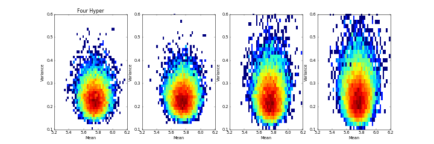
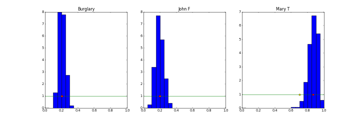

# MCMC Part 3: Learning

Note that burn-in and mixing plots are not included in this report as it is focused on hyper-parameters and not previous work in Metropolis. The plots, however, have been studied throughout the development of this project to ensure results are good.

## Faculty Model Learning

The following plots show the joint distribution of the parameters for mean and variance in the Faculty Evaluations Model as hyper-parameters are added. The initial figure shows the joint disbritution with no hyper-parameters. The figure after shows hyper-parameters being added in the following order: mean-mean, mean-variance, variance-alpha, variance-beta. The hyper-parameters used have the following fixed parameters

- Mean-Mean: Normal(5, 1.5)
- Mean-Variance: Inverse Gamma(alpha=2, beta=1/9)
- Variance-Alpha:
- Variance-Beta:

~~Add axis labels and title~~

~~Add axis labels and title~~

The histograms of added hyper-parameters trent to become slightly more spread out than the original histogram. The fixed parameters used in the hyper-parameters were chosen to have a means that mimic the previous mean and variance. If instead more "off" fixed parameters are chosen for the hyper-parameters The following results as they are added one-by-one.

~~Add axis labels and title~~

~~Results from 'off' hyper-parameters~~

~~Report on how distributions are affected~~

~~Test using more hyper-parameters?~~

~~Remeber to increase run parameters before runing final simulation~~

Interesting things to show:
- Eliminating data from the model
- Adding additional, unobserved, nodes to see how results change
- Add parent nodes and watch how they learn
	- What to look for?
	- Maybe watch for how estimates of mean and variance are affected

## Alarm Model Learning

In the Alarm Model I use Beta distributions to model the hyper-parameters for all of the simulations. In most cases the initial parameters used are alpha=1, beta=1. The posterior this way makes no assumption on what the probabilities are and is trained by the data.

### Hyper-parameter Learning

The following plots show results for the alarm node hyper-parameters. The hyper-parameters are added in the following groups.

Only three hyper-parameters:

- Alarm for Burglary true and Earthquake true
- Alarm for Burglary true and Earthquake false
- Alarm for Burglary false and Earthquake true

Half of hyper-parameters

- Alarm for Burglary true and Earthquake true
- Burlary

All of hyper-parameters

- Earthquake
- John for Alarm true
- John for Alarm false
- Mary for Alarm true
- Mary for Alarm false

In the first plot only the TT, TF, and FT cases are included. All simulations for these tests were run with 100 data nodes and for 1000 samples. In the plot, the yellow dot represets the actual parameter and the red dot represents the estimated parameter. The prior is also shown along with a histogram of the sampled posterior.

Although this is only a case study and in no way a proof, from my observation the number of estimated parameters has no visible affect on this scenario.

### Amounts of Learning Data

Using the same scenario as the previous section, the following are the alarm node hyper-parameters with three different amount of data: 20 data nodes, 100 data nodes, and 1000 data nodes. All hyper-parameters were included in this scenario.

Scince these observed nodes are all taken from the same child node, The following plots are from the same simulations but show various a few other samplings. The plots show the hyper-parameters of burglary, John given alarm false, and Mary given alarm true.

~~Observations from this scenario~~

### Original Parameter Learning

As a hypothesis, I would propose that the previous model will be more difficult to learn because of the lack of occurances of burglary and earthquake. Thus, more data nodes will be required to achieve a good simulation. Becaue of this, I am using the same three scenarios from the last section. That is, I have run the simulation for 20, 1000, and 1000 data nodes to see how the amount of data affects the result.

As also in the previous section, the following are the plots for hyper-parmeters burglary, John given alarm false, and Mary given alarm true.

~~Observations from this scenario~~

### Hyper-hyper Parameter Learning

### Missing Observations

- Randomly select samples to be removed as nodes are created

### Added Data Inference

### My Parameter Learning

I adjusted the probabilities on the Burglary and Alarm nodes as folloes

	P(Earthquake=True) = 0.5

	P(Alarm=True|Burglary=True,Earthquake=True) = 0.99
	P(Alarm=True|Burglary=True,Earthquake=False) = 0.98
	P(Alarm=True|Burglary=False,Earthquake=True) = 0.02
	P(Alarm=True|Burglary=False,Earthquake=False) = 0.01

To remove some of the data, I replaced each sample with NaN with probability of 1/4.

### Craig Bidstrup's Parameter Learning
