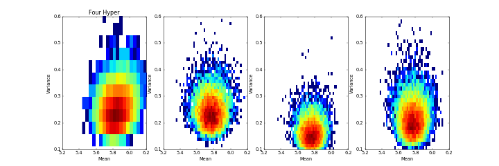
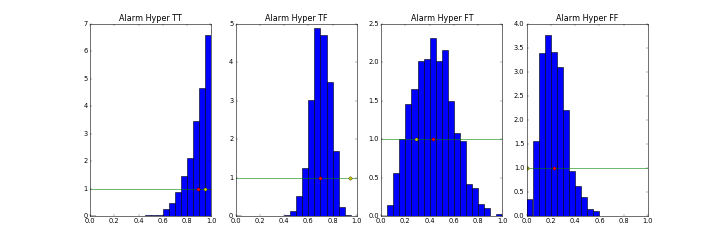

# MCMC Part 3: Learning

This document contains results from several experiments in parameter learning using Markov Chain Monte Carlo methods (Gibbs Sampling to be specific). Two specific models are used in this document. The first is the Faculty Evaluations model in which data nodes extend from a common mean and variance modeled as a normal and Inverse Gamma respectively. The second is the Alarm Model, an entirely Bernoulli based model. Some values were modified to accommodate ease of simulation of rare events. Note that burn-in and mixing plots are not included in this report as it is focused on hyper-parameters and not previous work in Metropolis. The plots, however, have been studied throughout the development of this project to ensure results are accurate.

## Faculty Model Learning

The following plots show the joint distribution of the parameters for mean and variance in the Faculty Evaluations Model as hyper-parameters are added. The initial figure shows the joint distribution with no hyper-parameters. The figure after shows hyper-parameters being added in the following order: mean-mean, mean-variance, variance-alpha, variance-beta. The hyper-parameters used have the following fixed parameters

- Mean-Mean: Normal(5, 1.5)
- Mean-Variance: Inverse Gamma(alpha=2, beta=1/9)
- Variance-Alpha:
- Variance-Beta:

The histograms of added hyper-parameters tend to become slightly more spread out than the original histogram. The fixed parameters used in the hyper-parameters were chosen to have a means that mimic the previous mean and variance. If instead more "off" fixed parameters are chosen for the hyper-parameters the following results as they are added one-by-one.

## Alarm Model Learning

In the Alarm Model I use Beta distributions to model the hyper-parameters for all of the simulations. Throughout the experiments the initial parameters used are alpha=1, beta=1. The posterior this way makes no assumption on what the probabilities are and is trained by the data.

### Hyper-parameter Learning

The following plots show results for the alarm node hyper-parameters. The hyper-parameters are added in the following groups.

Only three hyper-parameters:

- Alarm for Burglary true and Earthquake true
- Alarm for Burglary true and Earthquake false
- Alarm for Burglary false and Earthquake true

Half of hyper-parameters

- Alarm for Burglary true and Earthquake true
- Burglary

All of hyper-parameters

- Earthquake
- John for Alarm true
- John for Alarm false
- Mary for Alarm true
- Mary for Alarm false

In the first plot only the TT, TF, and FT cases are included. All simulations for these tests were run with 100 data nodes and for 1000 samples. In the plot, the yellow dot represents the actual parameter and the red dot represents the estimated parameter. The prior is also shown along with a histogram of the sampled posterior.

Although this is only a case study and in no way a proof, from my observation the number of estimated parameters has no visible affect on this scenario.

### Amounts of Learning Data

Using the same scenario as the previous section, the following are the alarm node hyper-parameters with three different amounts of data: 20 data nodes, 100 data nodes, and 500 data nodes. All hyper-parameters were included in this scenario.

Since these observed nodes are all taken from the same child node, the following plots are from the same simulations but show various other samplings. The plots show the hyper-parameters of burglary, John given alarm false, and Mary given alarm true.

A significant jump is made between 20 data nodes and 100 data nodes. The jump from 100 to 500 shows to be less significant although estimates are improved.

### Original Parameter Learning

As a hypothesis, I would propose that the previous model will be more difficult to learn because of the lack of occurrences of burglary and earthquake. Thus, more data nodes will be required to achieve a good simulation. Because of this, I am using the same three scenarios from the last section. That is, I have run the simulation for 20, 100, and 500 data nodes to see how the amount of data affects the result.

As also in the previous section, the following are the plots for hyper-parameters burglary, John given alarm false, and Mary given alarm true.

These results are quite interesting because of the failure of so many estimates to converge. Even at 500 data-nodes, the samples are far from converging for the majority of the alarm hyper-parameters as well as Mary given alarm=true.

### Hyper-hyper Parameter Learning

For this scenario, I included two gamma functions as hyper-hyper-parameters. The first is a hyper-hyper-parameter to the alpha of the hyper-parameter of alarm given burglary=true and earthquake=true. The parameters are set to have a wide variance and a mean centered at alpha = 1. The second hyper-hyper-parameter is on the burglary node. This is set similar to the one on the alarm parameter described except for the beta of the hyper-parameter. Below are the plots used in previous sections followed by a plot of the hyper-hyper-parameters.

Little affect is made by adding the additional hyper-hyper-parameters. Most importantly, is that there isn't any real negative affect. If the case is that parameters are added that are far from being correct, a greater negative affect will occur as we observed in the Faculty Model. In summary, the more information can be added the better. There comes a point, however, were we don't have new information we can add and thus it is not helpful to add additional levels of parameters if they are too vague to provide additional information.

### Missing Observations

To complete this task, I replaced each sample of the previous data set with NaN with probability 1/4. While reading the data in, NaN samples are made as unknown nodes. With 100 data points and 1000 samples the alarm hyper-parameters and other hyper-parameters used in previous sections have the following plots.

Once again there is little affect. Variance (e.g. spread of the histograms) is increased slightly, but no significant changes otherwise.

### My Parameter Learning

I adjusted the probabilities on the Burglary and Alarm nodes as follows

	P(Earthquake=True) = 0.5

	P(Alarm=True|Burglary=True,Earthquake=True) = 0.99
	P(Alarm=True|Burglary=True,Earthquake=False) = 0.98
	P(Alarm=True|Burglary=False,Earthquake=True) = 0.02
	P(Alarm=True|Burglary=False,Earthquake=False) = 0.01

To remove some of the data, I replaced each sample with NaN with probability of 1/4. Running my code the following plots for the alarm hyper-parameters and various other hyper-parameters are produced.

The estimated parameter values (mean of the samples produced) are as follows

	P(Earthquake=True) ~= 0.474

	P(Alarm=True|Burglary=True,Earthquake=True) ~= 0.477
	P(Alarm=True|Burglary=True,Earthquake=False) ~= 0.653
	P(Alarm=True|Burglary=False,Earthquake=True) ~= 0.031
	P(Alarm=True|Burglary=False,Earthquake=False) ~= 0.027

As you may see the results are less accurate than hoped. I believe this to be due to probability of burglary being true being a low probability event. Thus, the simulation fails to accurately estimate this probability for the probabilities dependent on burglary being true. I am currently running this simulation but it may still take much longer and I am turning this assignment in now. I will send an update when the simulation completes.

### Craig Bidstrup's Parameter Learning

Not knowing Craig's parameters for earthquake the following histograms are achieved (same hyper-parameters as in other scenarios) using my code. Data nodes and number of samples are once again 100 and 1000 respectively.

	P(Earthquake=True) ~= 0.286

	P(Alarm=True|Burglary=True,Earthquake=True) ~= 0.893
	P(Alarm=True|Burglary=True,Earthquake=False) ~= 0.699
	P(Alarm=True|Burglary=False,Earthquake=True) ~= 0.428
	P(Alarm=True|Burglary=False,Earthquake=False) ~= 0.225

