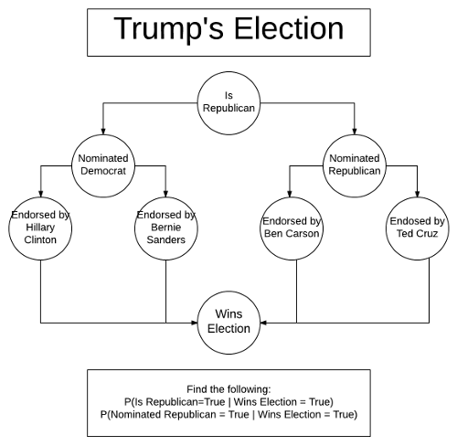

# MCMC Part 1: Boolean

## Burglar Alarm Model

My Gibbs sampler implementation gave the following results using 2000 samples.

	P(Burglary=true|John=true,Mary=true) = 0.2835
	P(Alarm=true|John=true,Mary=true) = 0.763
	P(Earthqake=true|John=true,Mary=true) = 0.1815
	P(Burglary=true|John=false,Mary=false) = 0.0005
	P(Burglary=true|John=true,Mary=false) = 0.005
	P(Burglary=true|John=true) = 0.0215
	P(Burglary=true|Mary=true) = 0.066

## Trump Election Model (My Model)

The following diagram describes my model.

	P(Is Republican=true) = 0.5
	
	P(Nominated Republican=true|Is Republican) =
	T: 0.7
	F: 0.01

	P(Nominated Democrat=true|Is Republican) =
	T: 0.001
	F: 0.6

	P(Endorsed by Carson=true|Nominated Republican) =
	T: 0.8
	F: 0.1

	P(Endorsed by Cruz=true|Nominated Republican) =
	T: 0.5
	F: 0.01

	P(Endorsed by Sanders=true|Nominated Democrat) =
	T: 0.5
	F: 0.001

	P(Endorsed by Clinton=true|Nominated Democrat) =
	T: 0.6
	F: 0.01

	P(Wins Election=true|Carson, Cruz, Sanders, Clinton) =
	TTTT: 0.999
	TTTF: 0.98
	TTFT: 0.99
	TTFF: 0.7
	TFTT: 0.8
	TFTF: 0.8
	TFFT: 0.5
	TFFF: 0.5
	FTTT: 0.3
	FTTF: 0.5
	FTFT: 0.3
	FTFF: 0.01
	FFTT: 0.1
	FFTF: 0.01
	FFFT: 0.001
	FFFF: 0.0001

Given the model I want to find P(Is Republican=true|Wins Election) and P(Republican Nomination=true|Wins Election). The results are below.

	P(Is Republican=true|Wins Election=true) = 0.8155
	P(Republican Nomination=true|Wins Election=true) = 0.792

## David Wheeler's Model

Using David Wheeler's Model I get

	P(A=true|D=false,E=false) = 0.8765

## Parker Lusk's Model

My results for Parker Lusk's Model are as follows.

	P(A=true|D=true) = 0.892
	P(D=true|A=true,B=true) = 0.0595
